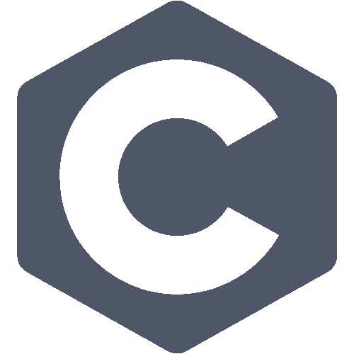
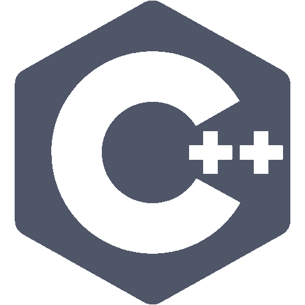
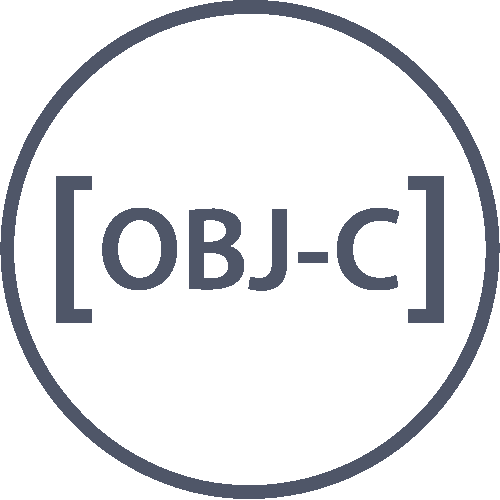
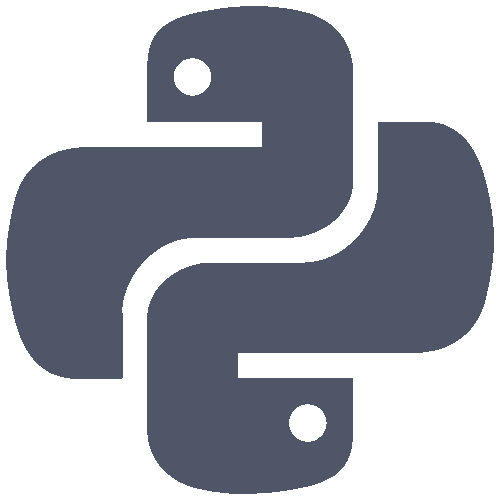
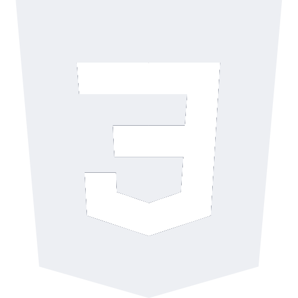
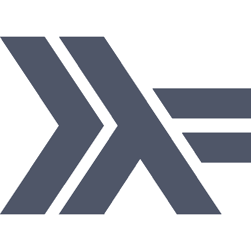
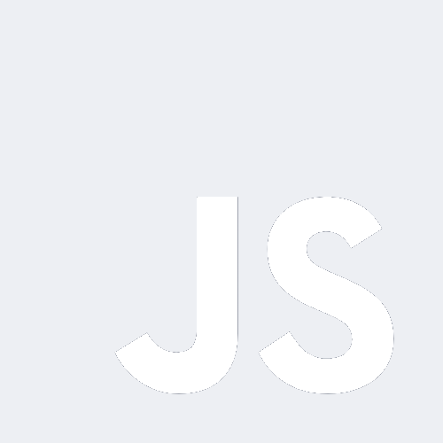
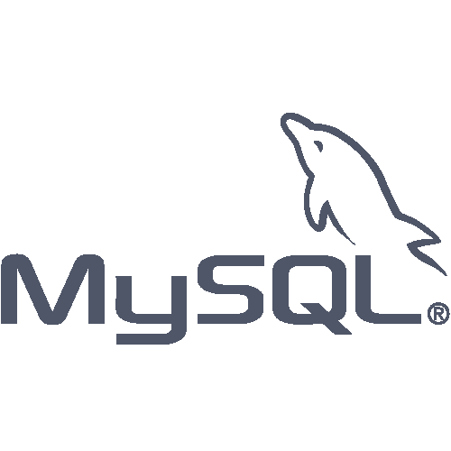

<h3>Hi There 👋🏻</h3>

I'm <strong>Tim</strong>, a <strong>junior developer</strong> and <strong>IT student</strong> passionate about productivity and automation.

I first studied in a private programming school for 2 years. There, I learned few languages like <strong>Bash / Shell Scripting</strong>, <strong>C</strong>, <strong>C++</strong>, <strong>Python</strong>, <strong>Docker</strong>. I also entered <strong>unix</strong> world and never left it since 2020. Btw, been using <strong>[Arch](https://garudalinux.org/)</strong> for a while now.

I'm currently studying at university, where I'm learning a lot about software development. Will graduate in 2026.

I have worked for 6 months as an <strong>[intern application developer](https://github.com/TLacault/internship)</strong>.
Used <strong>JavaScript</strong> and <strong>JSON</strong> to build a car dashboard, <strong>Markdown</strong> and <strong>NodeRed</strong> to create a diagnostic system based on the car component's alerts and data.

I'm passionate about <strong>[productivity tools](https://www.notion.so/)</strong>, <strong>[unix customization](https://www.reddit.com/r/unixporn/)</strong>, and <strong>automation scripts</strong>.

<h2 align="left">Languages and Tools :</h2>

             

<h2 align="left">Contact :</h2>

* <strong>Contact : contact@dev-tlacault.eu</strong>